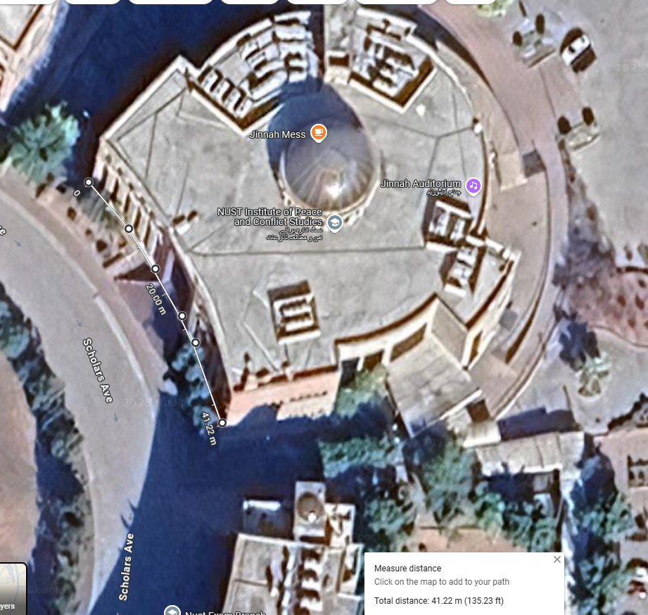
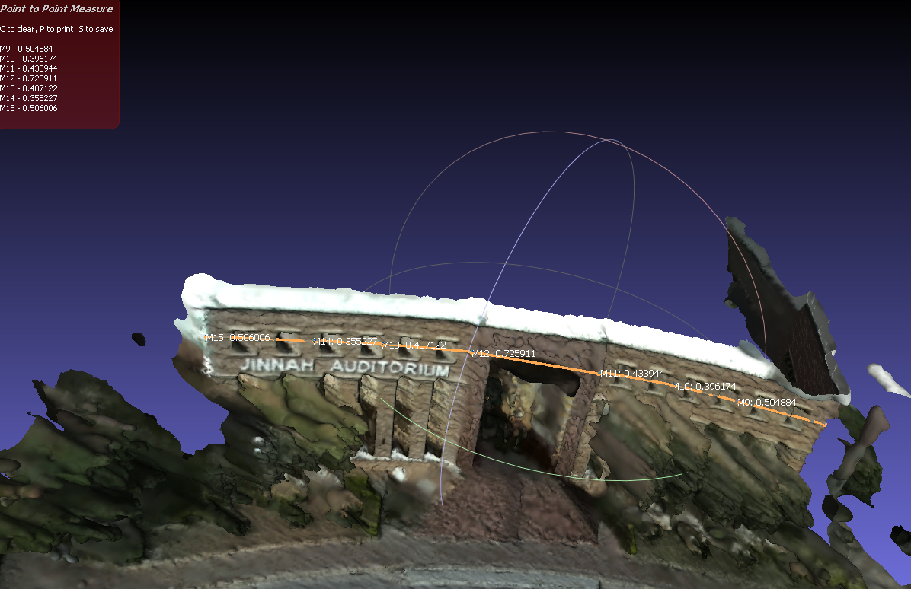

# 🏛️ NUST 3D Reconstruction – HQ, Library & Jinnah Auditorium

This project showcases a full 3D reconstruction of the NUST Pakistan HQ, Library and Jinnah Auditorium using **COLMAP**. It includes both **sparse** and **dense** reconstructions, mesh generation, and **metric scaling** using real-world measurements.

---

## 📸 Input Data

- A collection of images capturing various angles of the NUST Library and Auditorium.

## 🛠️ Reconstruction Pipeline

1. **Feature Extraction**: Detect and extract features from input images.
2. **Feature Matching**: Match features across images to establish correspondences.
3. **Sparse Reconstruction**: Perform Structure-from-Motion (SfM) to estimate camera poses and generate a sparse point cloud.
4. **Dense Reconstruction**: Use Multi-View Stereo (MVS) to generate a dense point cloud.
5. **Meshing**: Create 3D meshes from the dense point cloud using Poisson or Delaunay meshing.

## 🎬 Dense 3D Reconstruction Demo

*Above: Rotating view of the dense 3D point cloud generated with COLMAP.*

---

## 📏 Metric Reconstruction Using Real-World Scaling

To convert the 3D reconstruction into **real-world metric scale**, I followed this process:

### 1. 📐 Real-World Measurement (Google Maps)

Used Google Maps to measure the **length of Jinnah Auditorium**’s exterior wall.

*Measured length: ~50 meters*

---

### 2. 🧱 Model Measurement (COLMAP/Viewer)

Measured the **same wall** in the unscaled mesh using a 3D viewer.

*Measured length in mesh units: ~5 units*

---

### 3. ⚖️ Scaling the Model

Calculated the scale factor:

Scale Factor = Real Length / mesh Length = 41.22 / 3.41 = 12.1

Applied this factor to rescale the model, resulting in a **metric-accurate 3D reconstruction**.

---

